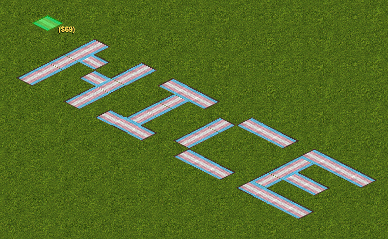
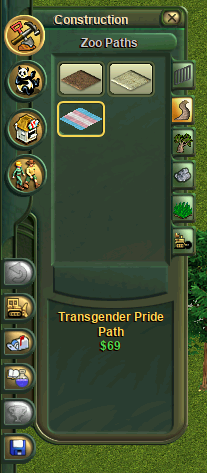
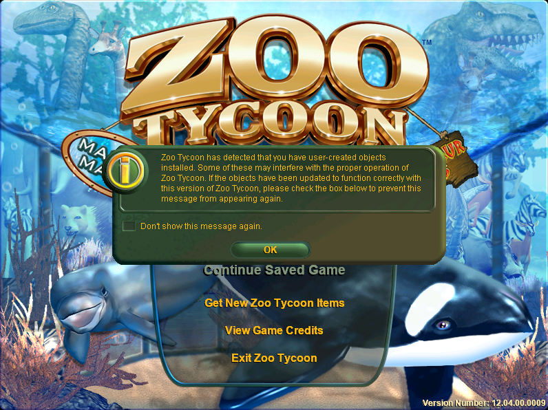
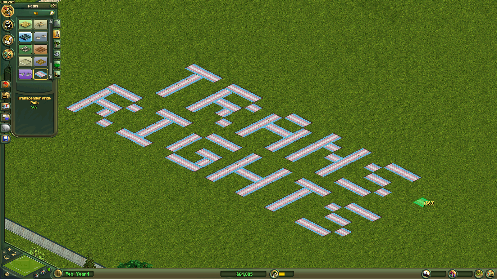

# Zoo Tycoon Transgender Pride Flag Path

A simple mod that adds a transgender pride flag path to Zoo Tycoon.
Each tile costs $69.

### Table of Contents

* [Setup](#setup)
  * [Requirements](#requirements)
  * [Conflicts](#conflicts)
  * [Installation & Usage](#installation-and-usage)
* [Notes/FAQ](#notesfaq)
* [Contributing](#contributing)
* [License](#license)

## Setup

### Requirements

* Zoo Tycoon 1

This mod works perfectly fine with the base game or Complete Collection.
It does not have any dependencies - you can install this in an otherwise
unmodded game.

It has been confirmed to work just fine in Zoo Tycoon running on Linux
under Wine in both the base game and Complete Collection.

### Conflicts

This mod has no known conflicts.

### Installation and Usage

1. Fetch the latest `ztd` file from the
   [releases page](https://github.com/Zt-freak/ZT1TransgenderPrideFlagPath/releases)
2. Drop into any directory along the `path` variable defined in `zoo.ini`
   (if you don't know what this refers to, just navigate to the Zoo Tycoon
   program files and drop the `ztd` file into the `Updates` directory)
3. Launch the game and open a scenario or save
4. Under Construction > Zoo Paths, there should now be a "Transgender Pride
   Path" option
   

## Notes/FAQ

> What's the difference between the zip and ztd files on the releases page?
> I thought a ztd was just a zip file with a different extension.

GitHub's auto-zipping functionality produces a zip file, but it seems that
Zoo Tycoon depends on specific quirks in Windows' zip implementation,
as GitHub's auto-generated zip file (renamed to ztd) is ignored by the game,
but a zip file generated via Windows Explorer (also renamed to ztd) is loaded
as expected.

> When I launch the game, I get a message that reads as follows:

> > Zoo Tycoon has detected that you have user-created objects
> > installed. Some of these may interfere with the proper operation of
> > Zoo Tycoon. If the objects have been updated to function correctly with
> > this version of Zoo Tycoon, please check the box below to prevent this
> > message from appearing again.

> 

You can check the "Don't show this message again" box.
This message has only been observed in the Complete Collection,
not the base game.

This mod works fine in the Complete Collection; no new bugs have been observed
as a result of installing this mod.

> What happens if I send somebody a save file with trans pride paths but they
> do not have the mod installed?

The path tiles will be automatically removed when the game is saved next.
Anything on the path tiles will still be there when the game is loaded next,
but the tiles will be gone and the person you sent the save to will need to add
new path tiles to replace them.

> Does Zoo Tycoon say "trans rights"?

Yes, it does.

## Contributing

If you would like to suggest features, report bugs, etc., feel free to open an
issue.

If you would like to help develop the application, merge requests are welcome.
For major changes, please open an issue first to discuss what you would like
to change.

## License

This project is licensed under the MIT license - see the [LICENSE](LICENSE)
file for details.
